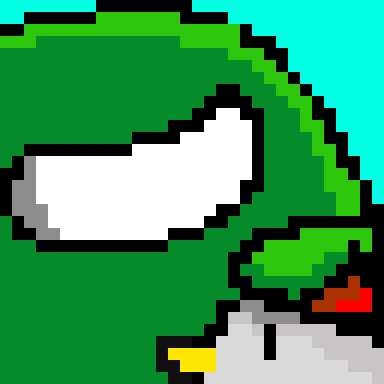

<h1 align=center>Space Invaders</h1>

Game bắn người ngoài hành tinh cho lớp Lập trình nâng cao

Game sử dụng C++ và thư viện SFML

## How to play
- W, A, S, D to move, Left-click to shoot
- You lose HP colliding with the enemy
- 1, 2, 3 to change the enemies
- P to get the special ship, Z for default
 
## Cloning and building
- Download the [SFML](https://www.sfml-dev.org/download/sfml/2.6.0/) for Visual C++ 17 (2022) - 32-bit
- Copy `include` and `lib` folders to `External` folder on the project
- Copy the .dll in `bin` folder to `Space Invaders` folder that contains project files and the Audio, Textures.. folders

## Credit and sources
Sprite and icon made from: https://www.piskelapp.com

Background is a screengrab from the Among Us game map update

Special ship made by Phan Trung Hieu (thanks bro!)

OST: [In the House, In a Heartbeat - John Murphy (28 Days Later Soundtrack) [Metal Remix]](https://youtu.be/c8QNTsOJ1kc)